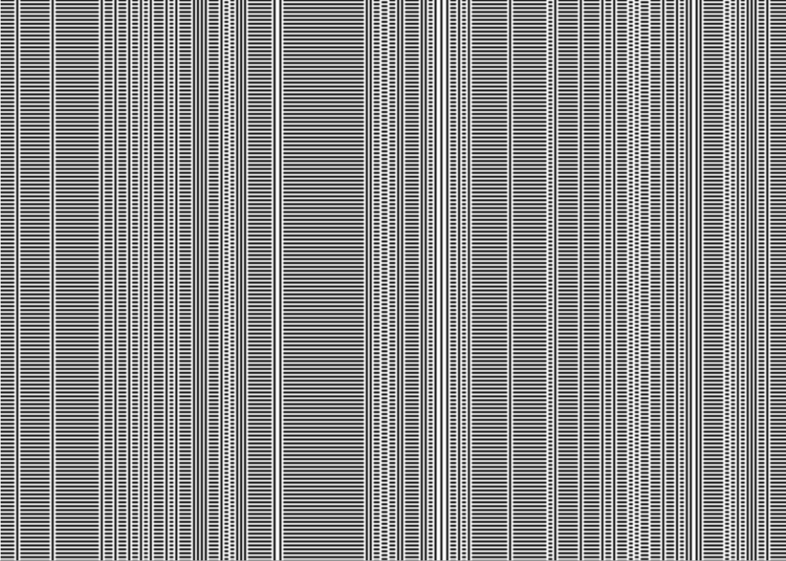

Michał Drzał
------------

Cellular automata report
========================

Simple 1D cellular automata
---------------------------

Code visualising cellular automata is [here](../cellular).

Sample rules visualised:

Rule 5

Nagel-Schreckenberg model
-------------------------
