Michał Drzał
------------

Cellular automata report
========================

Simple 1D cellular automata
---------------------------

Code visualising cellular automata is [here](../cellular).

Sample rules visualised:

Rule 5

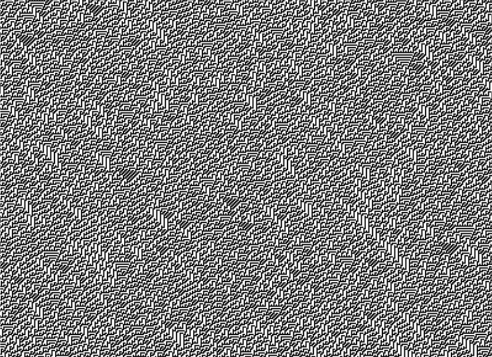

Rule 45

Rule 54

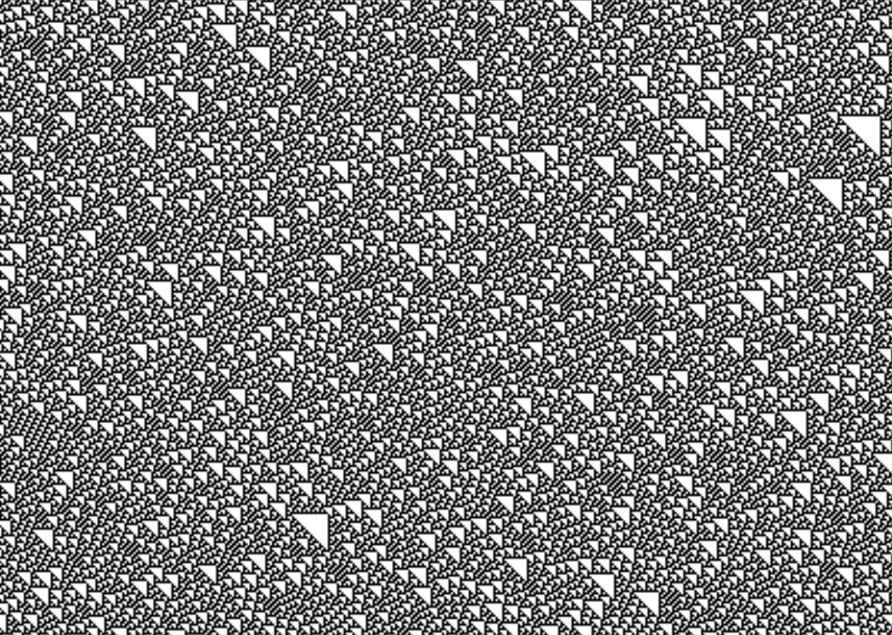

Rule 60

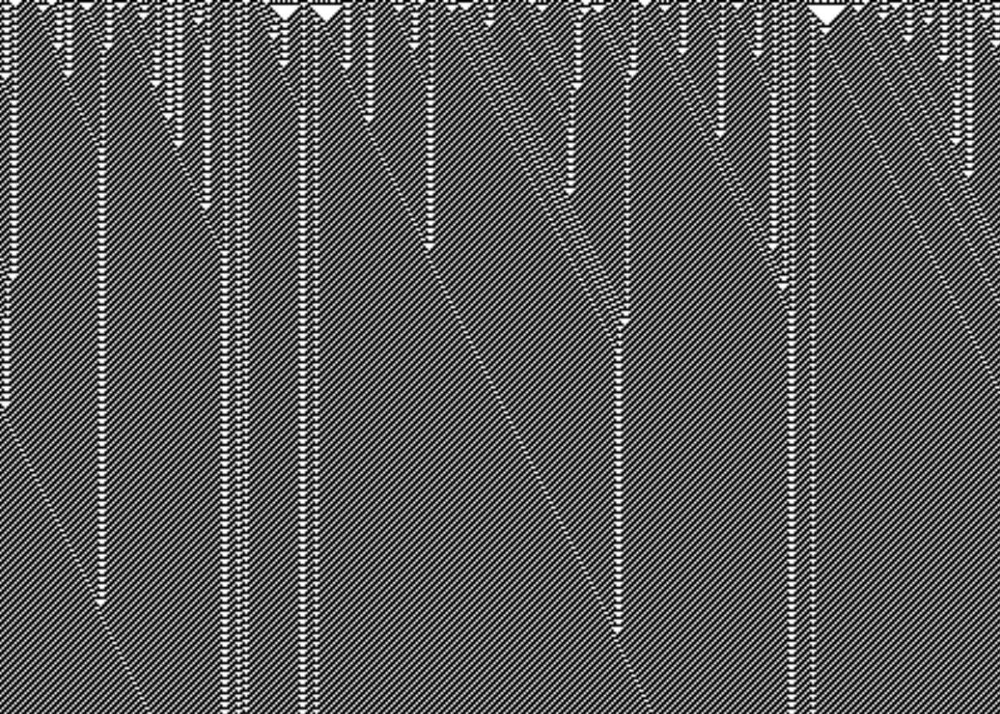

Rule 62

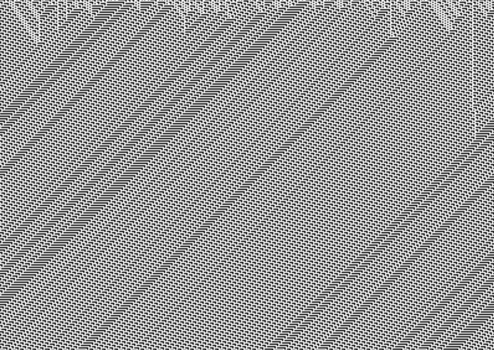

Rule 65

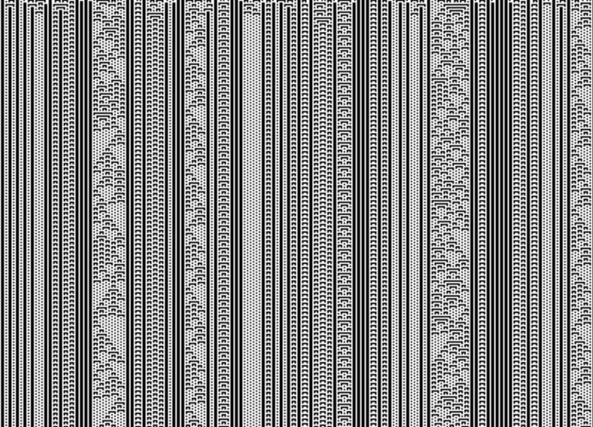

Rule 73

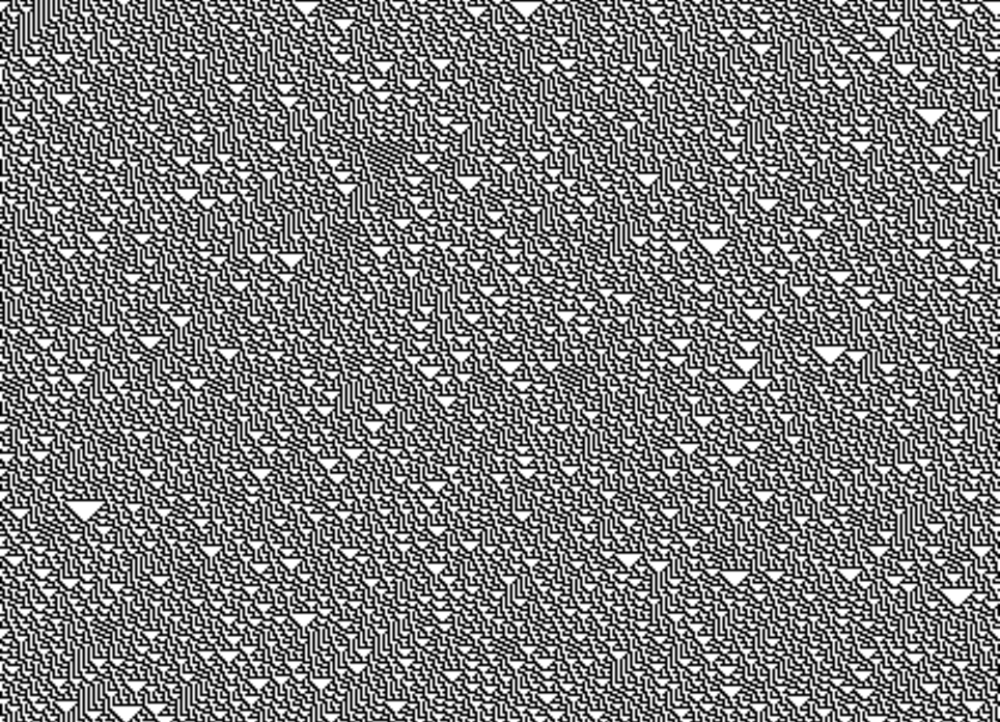

Rule 86

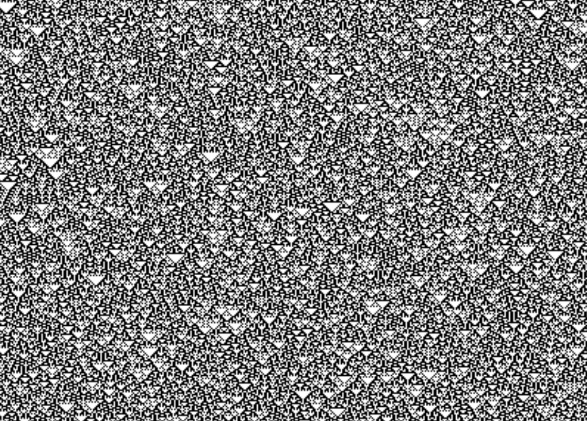

Rule 90

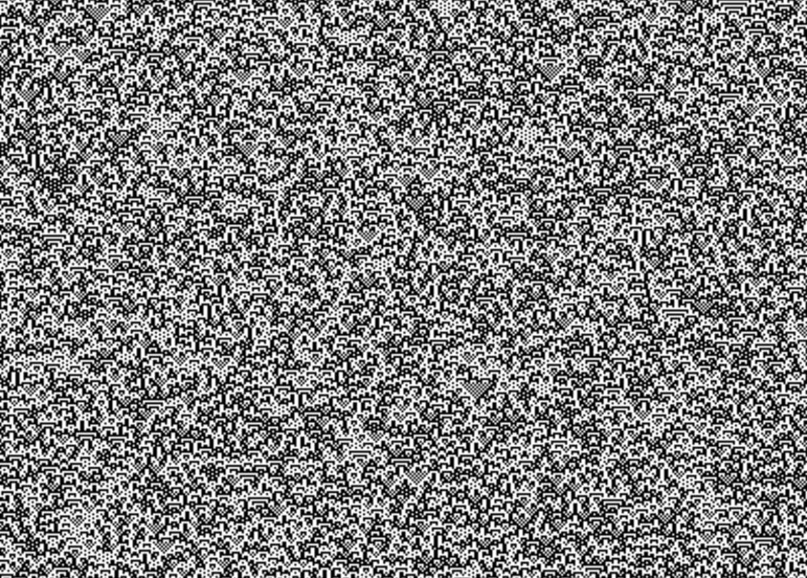

Rule 105

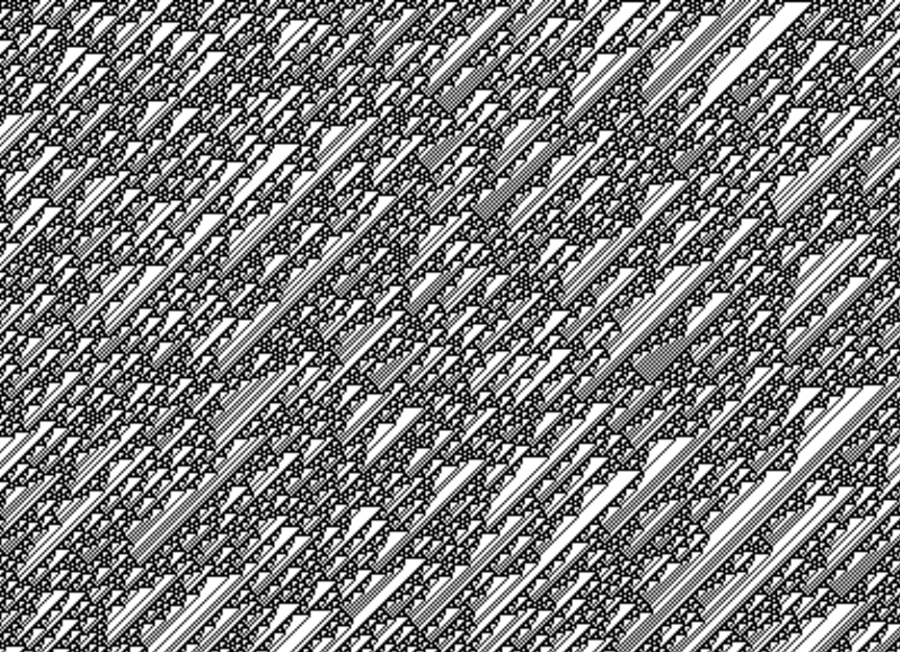

Rule 106

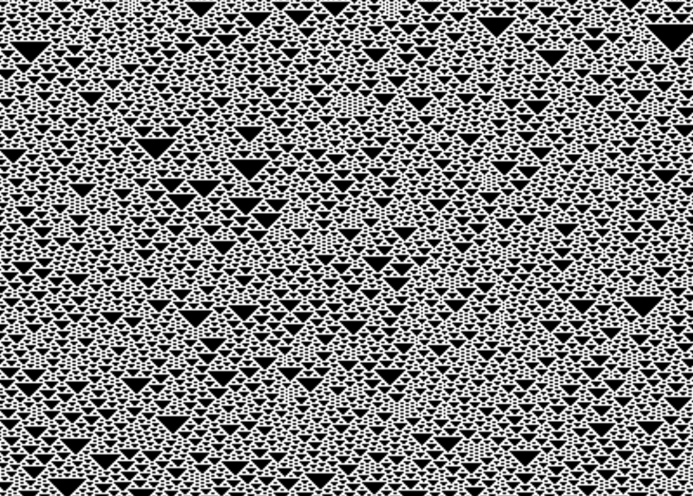

Rule 129

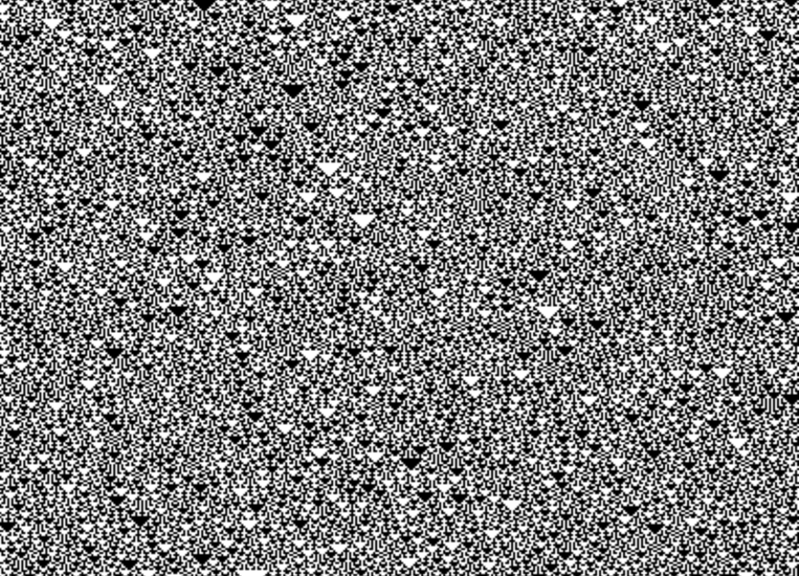

Rule 150

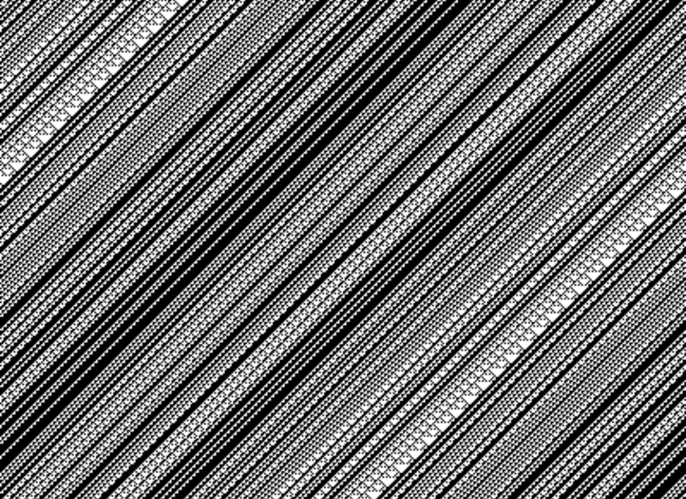

Rule 154

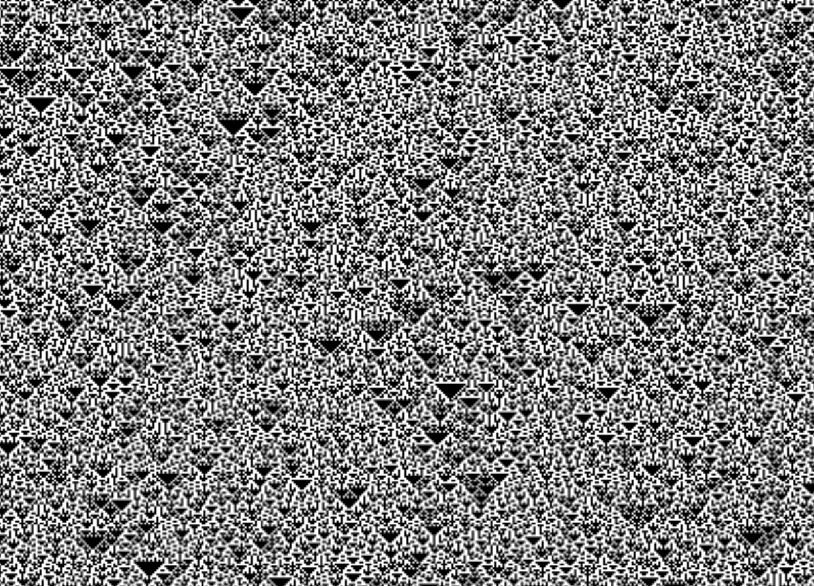

Rule 165

Rule 184

Nagel-Schreckenberg model
-------------------------
