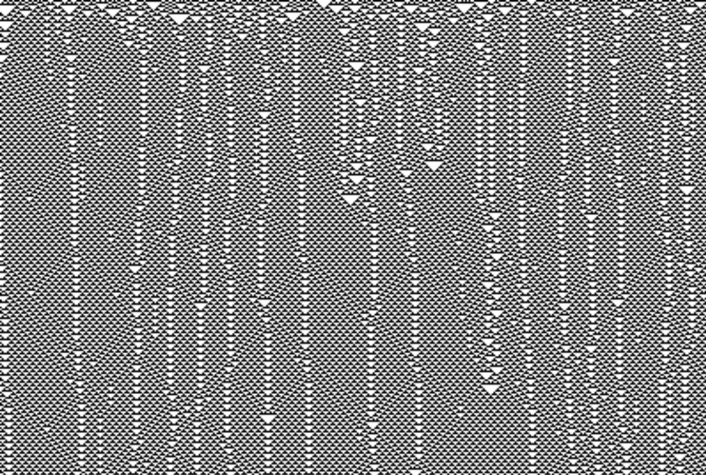

Michał Drzał
------------

Cellular automata report
========================

Simple 1D cellular automata
---------------------------

Code visualising cellular automata is [here](../cellular).

Sample rules visualised:

Rule 5

Rule 45

Rule 54

Rule 60

Rule 62

Rule 65

Rule 73

Rule 86

Rule 90

Rule 105

Rule 106

Rule 129

Rule 150

Rule 154

Rule 165

Rule 184

Nagel-Schreckenberg model
-------------------------
